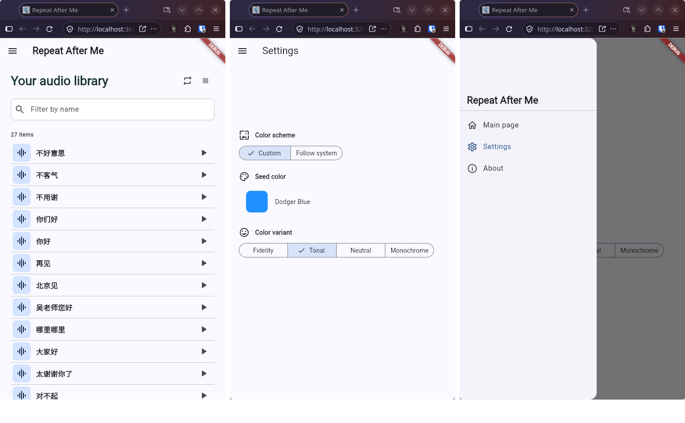

# Repeat After Me

語学学習用の音声フレーズ一覧アプリです。`assets/audio/` にある `.m4a` ファイル名を一覧表示し、検索できます。

## 機能

- 音声ファイル名から拡張子を除いて一覧表示
- 名前のインクリメンタル検索
- リスト項目の選択で音声を再生し、再度選択すると一時停止
- タイトル横の連続再生ボタンでリストを連続再生し、停止ボタンで停止: 最後に再生した項目（なければ先頭）から上から順に再生し、各項目の終了後に1秒空けて、末尾の次は先頭に戻る。連続再生中は各項目の再生ボタンを無効化
- 連続再生は開始から15分後に自動停止。手動で停止するとタイマーも停止し、再開すると15分から数え直す
- システム言語が日本語の場合は日本語、それ以外は英語で表示
- シードカラー、カラーバリエーション、システム配色の設定
- 外観設定を端末に保存し、次回起動時に復元

## 音声ファイルの追加

`.m4a` ファイルを `assets/audio/` に追加してください。例:

```text
assets/audio/
├── hello.m4a
└── good_morning.m4a
```

アプリには `hello`、`good_morning` として表示されます。追加後に Flutter の実行またはビルドをやり直してください。

## 開発

Flutter SDK をインストールした環境で実行します。

```sh
flutter pub get
flutter run
```

テスト:

```sh
flutter test
```

Web ビルド:

```sh
flutter build web
```

生成物は `build/web/` に出力されます。Web での音声再生はブラウザーの M4A/AAC 対応状況に依存します。

## スクリーンショット

アプリのスクリーンショットを以下に示します。


**アプリのスクリーンショット**

## ライセンス

このプロジェクトは MIT ライセンスの下で公開されています。詳細は `LICENSE` ファイルを参照してください。